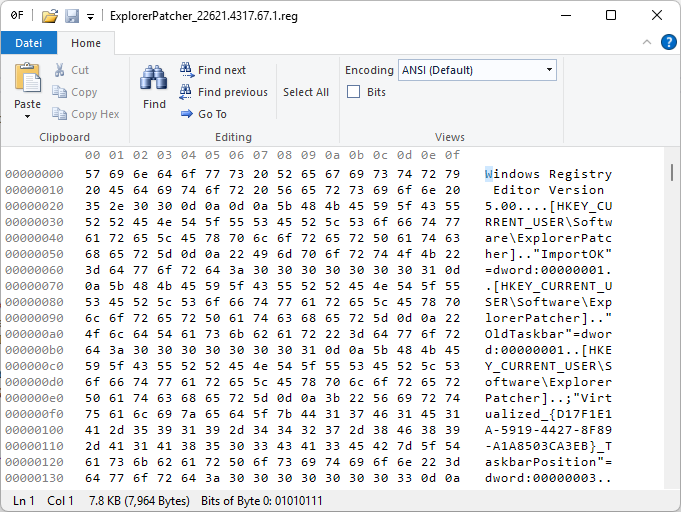

# HexEdit-Ribbon

This repository mirrors the source code of the [Be.HexEditor](http://sourceforge.net/projects/hexbox/) project created by Bernhard Elbl.
I developed a Ribbon based version of this HexEditor. It uses the RibbonFramework.CCW from [WinForms-Ribbon](https://github.com/harborsiem/WinForms-Ribbon).





## Changes

_See the [CHANGELOG.txt](HexEdit-Ribbon/CHANGELOG.txt) for the full list of changes._

This repository also includes the following additions:

- Update to .NET8
- Changes made by [Jaroslav Imrich](https://github.com/Pkcs11Admin/Be.HexEditor) for the NuGet package
- The ability to color regions in the hex view with a different background color as can be seen below

## Usage

``` cs

HexView.HighlightedRegions.Add(new HighlightedRegion(0, 12, Color.Purple));

```

## NuGet Package

[Nuget package for HexBox](https://www.nuget.org/packages/be.windows.forms.hexbox.net8)

[](https://www.nuget.org/packages/be.windows.forms.hexbox.net8)
[](https://www.nuget.org/stats/packages/be.windows.forms.hexbox.net8?groupby=Version)


HexBox versions available for

- .NET Framework 4.6.2 and later
- .NET 8.0 and later


## License

This project is licensed under MIT, see the [LICENSE](HexEdit-Ribbon/LICENSE.txt) file for more details
